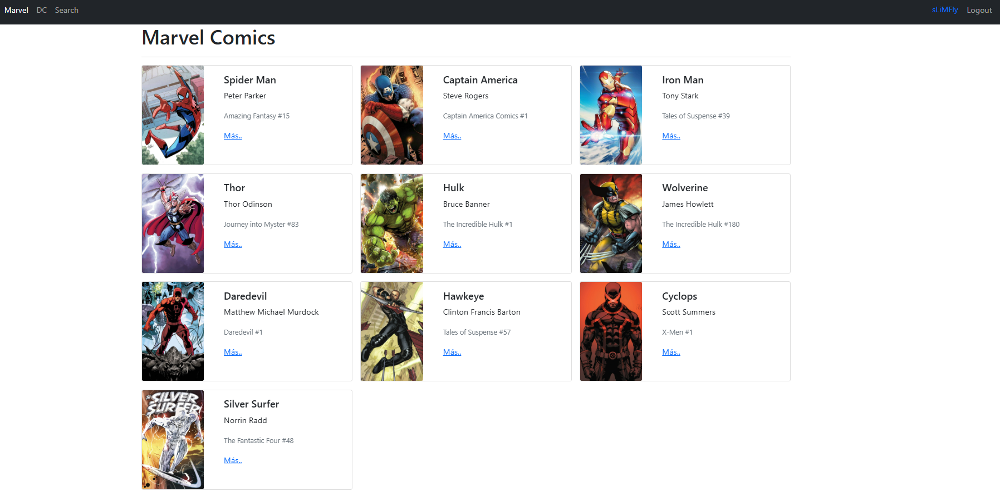

# React Heroes
Show different heroes with react.


## Clone and Install 
```shell
git clone https://github.com/sLiMFly/react-heroes.git
yarn
```

## Run
```js
yarn dev
```

# Demo

https://slimheroes.netlify.app

## Screenshots

<p align="center">
    
</p>
